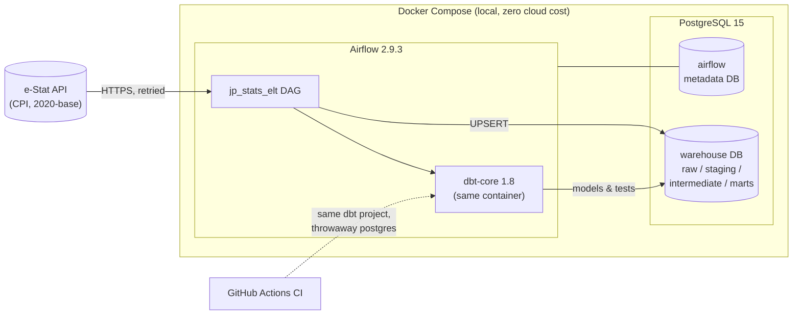
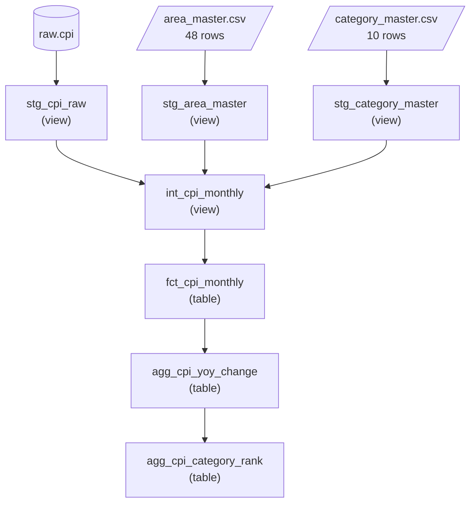
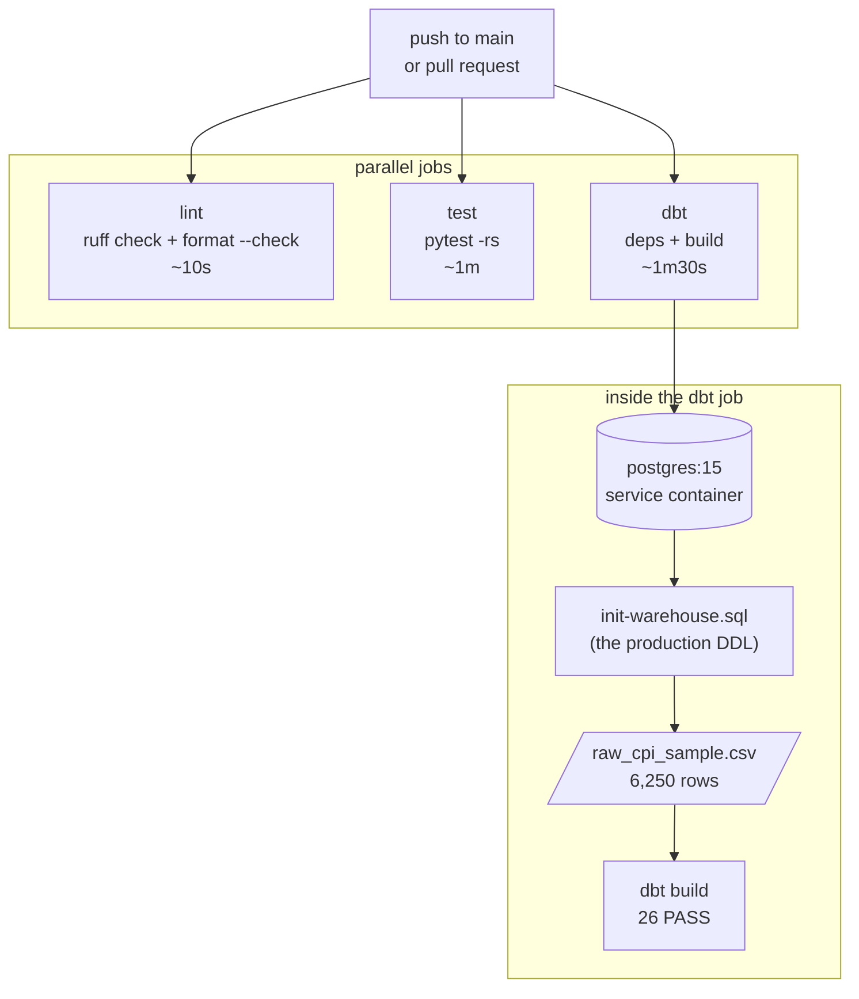

# Architecture

> How the pieces fit together and why they are arranged this way.
> For *what was decided when*, see [project-status.md](project-status.md);
> for *how to run it*, see the [README](../README.md).

## Components



Everything runs on one machine. PostgreSQL holds two logical databases — Airflow's
own metadata and the analytical `warehouse` — so the orchestrator's state never
mixes with the data it produces.

**dbt lives in the Airflow container rather than beside it.** A separate dbt
container would have been cleaner in isolation, but co-locating them means the DAG
can invoke dbt through `BashOperator` without any cross-container plumbing, and the
dependency set is resolved once in a single `Dockerfile`. The cost is that Airflow
and dbt must agree on shared libraries; that bill came due with protobuf, which
dbt-core 1.8 needs at `>=5.0` while Airflow's constraints pin it to 4.25.3. The
resolution was ordering — install protobuf 5.29.6 *after* the constrained install
so nothing pulls it back down.

CI reuses the same dbt project against a throwaway postgres service, so the models
are exercised on every push without depending on the local stack.


---

## Data lineage



| Layer | Materialization | Responsibility |
|---|---|---|
| `staging` | view | 1:1 typed mapping of the source. Rename, cast, derive `period DATE`. Nothing is filtered out |
| `intermediate` | view | Join the masters, and decide **which periods are fit for analysis** |
| `marts` | table | Persisted facts and aggregates that downstream consumers read |

### Why staging filters nothing

e-Stat publishes the latest month city by city, so the most recent period is
permanently incomplete — 2026-07 currently holds Tokyo (`13A01`) and nothing else.
Left in place, a regional ranking becomes meaningless and a nationwide average
spikes in its final month.

The filter still does not belong in staging. That layer's contract is to be a
faithful mapping of the source; the moment it starts dropping rows, "what does raw
actually contain" stops being answerable from the model. Selecting the analysable
periods is a business judgement, so it lives in `intermediate`.

### Why the completeness test counts rather than hardcodes

```sql
having count(distinct area_code) = (select count(*) from stg_area_master)
```

Writing `= 48` would work today and break silently the moment the extraction scope
changes. Phrased as a count against the master, the rule reads as what it is:
*only months where every defined area reported*. The weakness is the mirror image —
a stray row in the master would exclude every month and leave marts empty — which is
why marts carry grain tests that would fail loudly rather than return nothing.

### Why `intermediate` and `marts` look almost identical

`fct_cpi_monthly` selects from `int_cpi_monthly` with little transformation, which
invites the question of why both exist. The answer is the materialization column
above: `intermediate` is a view, `marts` is a table. Without the table, both
downstream aggregates would re-compute the same three-way join on every query.
The layers are not separated by how much SQL they contain but by what they cost.


---

## Idempotency

Re-running the pipeline for the same period must leave the warehouse in the same
state, whether the previous run succeeded, failed halfway, or is simply being
repeated.

`raw.cpi` is keyed on the four natural identifiers that e-Stat itself uses:

```sql
ON CONFLICT (tab_code, area_code, category_code, time_code)
DO UPDATE SET value = EXCLUDED.value, ..., loaded_at = now()
```

A second run of the same extraction therefore updates rows in place rather than
appending duplicates. This was verified against the database, not assumed: after a
re-run the row count was unchanged and only `loaded_at` had moved.

**There is no `execution_date` partition key.** An early sketch of this project
assumed one, on the reasoning that Airflow's logical date is the natural partition.
It is not, here. The extraction window is a *rolling* sixty months resolved at
runtime from the API's own time axis, so the same logical date can legitimately
return a different set of months as new data is published. Keying on the data's own
identity rather than on when the pipeline happened to run makes a backfill and a
scheduled run indistinguishable, which is the property actually wanted.

Downstream, dbt provides idempotency by construction: every model is rebuilt from
its inputs on each run, so there is no incremental state to drift.


---

## Retries and failure modes

Retries exist at two levels, and they are deliberately different in character.

| Level | Setting | Handles |
|---|---|---|
| Inside `extract_estat` | 5 attempts, exponential backoff (1-2-4-8-16s) | Transient API faults: HTTP 429/5xx, network errors, and e-Stat's in-body `STATUS` codes in the 200s |
| Airflow task | `retries=2`, `retry_delay=5min` | Everything else: a task that died, a database that was briefly unreachable, a maintenance window that outlasted the inner backoff |

The inner loop retries on the scale the API misbehaves at — seconds — and gives up
after roughly half a minute. The outer one retries on the scale an outage lasts, so
a Sunday-morning maintenance window that returns 502 has a chance to clear before
the run is declared failed.

**Not everything is retried.** The client distinguishes transient failures from
permanent ones: `STATUS` 100 (bad key), 101 (missing parameter), 102 (invalid
value) and 300 (no data) mean the request itself is wrong, and retrying an
incorrect request only wastes time and hides the error. Those raise immediately.

### Failure surfaces worth naming

**A successful task is not a successful load.** `validate_load` exists because
`extract_estat` returning


---

## CI pipeline



The three jobs are independent, so a formatting slip does not hide a broken model
behind it — all three report at once.

### Installing only what each job needs

`lint` installs ruff alone. Pulling the full dependency set would add minutes to a
job that never imports the code it checks. `test` installs `requirements.lock`
first and dev extras second, mirroring how the Docker image is built, so a test
that passes in CI is passing against the same resolved versions that run in
production.

**Lint tools have to be pinned like any other dependency.** `ruff` was declared
without a version, which meant local and CI could resolve to different builds and
disagree about what counts as an error. It is pinned at `0.16.4` now — and the pin
earned itself immediately, because `requirements.lock` still carried ruff 0.3.3 from
Week 1-2. Without it CI would have linted with a version thirteen minors behind the
one on the developer's machine.

### Giving dbt something to build

CI has no extracted data, so `dbt build` has nothing for `stg_cpi_raw` to select
from. Three options were on the table:

| Option | Why not |
|---|---|
| Exclude the source and staging models | Everything downstream depends on `stg_cpi_raw`, so the run would verify almost nothing |
| Call the e-Stat API from CI | Every run would depend on an external service that returns 502 during maintenance windows |
| Commit a fixture | Chosen |

`tests/fixtures/raw_cpi_sample.csv` is a fourteen-month slice of the real data. CI
runs `scripts/init-warehouse.sql` — the same DDL the Docker stack uses, so the CI
schema cannot drift from production — and copies the fixture in.

The fixture deliberately includes **2026-07, which covers a single area**. Without
an incomplete month present, the complete-month filter would have nothing to remove
and a regression that dropped the `HAVING` clause would pass. With it, raw holds
6,250 rows and marts hold 6,240, and that difference is what the run actually
proves.

No CI-specific dbt target was needed: `profiles.yml` already reads every field from
`env_var`, so exporting `WAREHOUSE_*` points the existing `dev` target at the
service container. A decision made in Week 1-2 to keep credentials out of the
repository turned out to be what made CI trivial six weeks later.


---

## Trade-offs

This runs on a laptop, and several choices only make sense under that constraint.
Naming them is more useful than pretending they generalise.

### What would change in production

**dbt would not be invoked through `BashOperator`.** Today the whole dbt project is
one opaque Airflow task: if `agg_cpi_yoy_change` fails, the UI says `dbt_run`
failed. [Cosmos](https://github.com/astronomer/astronomer-cosmos) renders each dbt
model as its own Airflow task, which gives per-model retries, accurate lineage in
the UI, and failure messages that name the model rather than the command. The
reason it is not here is that wiring dbt dependencies by hand first is what makes
the value of Cosmos legible.

**PostgreSQL would not be the warehouse.** A single Postgres instance is the right
call for 28,000 rows and zero budget, but the marts rebuild every table from
scratch on each run. That is fine at this scale and untenable at a hundred times
it. A columnar store with partition-aware incremental models — DuckDB locally,
Snowflake or BigQuery in an organisation — is the direction, and it changes the
model code, not just the infrastructure.

**Secrets would not live in `.env`.** Fine for a single developer; wrong the moment
more than one person or one environment is involved. Secrets Manager, Vault, or the
orchestrator's own backend, with rotation.

**`validate_load` would be a real data contract.** A row-count floor catches a
truncated response and nothing subtler. Great Expectations is already in the image
for exactly this: distributional checks, type contracts, and a failure that reports
*what* was wrong rather than *that* something was.

### What was traded away on purpose

**Extract and load are one task, not two.** The canonical ELT diagram separates
them. Here they are technically inseparable — the DataFrame goes from memory
straight into the UPSERT — and forcing a split would mean passing a large object
through XCom, which is fragile and slow. `load` was repurposed into a validation
gate instead, which is a more honest description of what that position in the
pipeline is for.

**The schema-name macro is overridden.** dbt's postgres adapter concatenates
`<target>_<custom>` by default, producing `staging_staging`. The default exists to
stop developers colliding in a shared warehouse; with one developer and a local
database there is nothing to collide with, so the prefix is stripped. In a team
warehouse this override would be actively harmful.

**Sixty months, ten categories, forty-eight areas.** The extraction scope is a
deliberate subset. e-Stat exposes far more, and the pipeline would ingest it without
structural change — the ceiling is the single Postgres instance, not the code.

### What the fixture does not cover

CI proves the models compile, the grain holds, and the filters fire. It